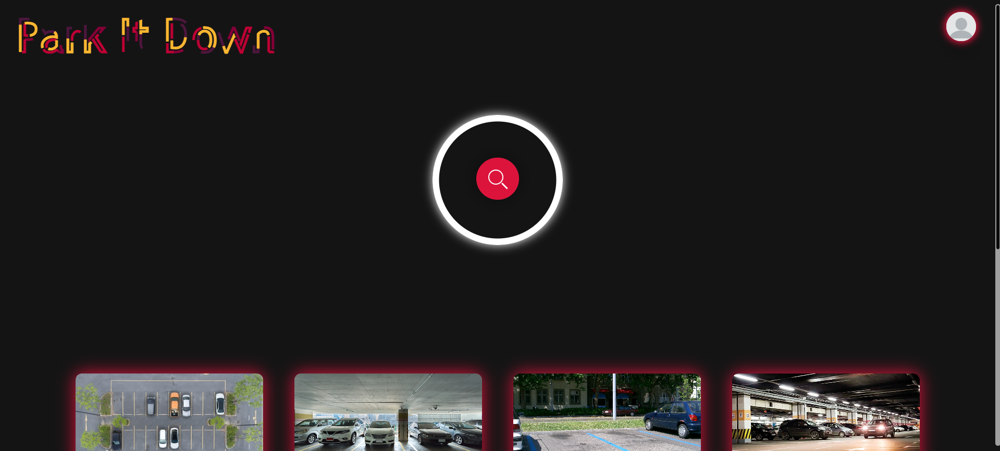
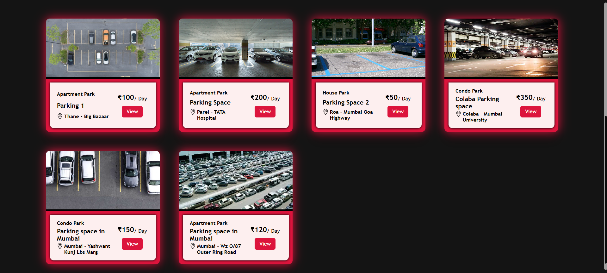
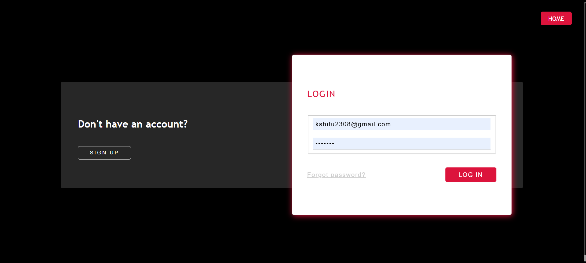
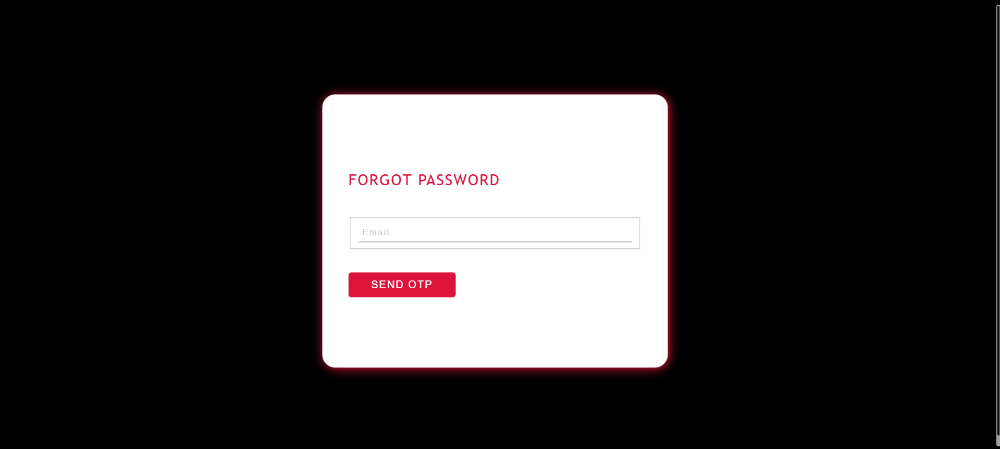
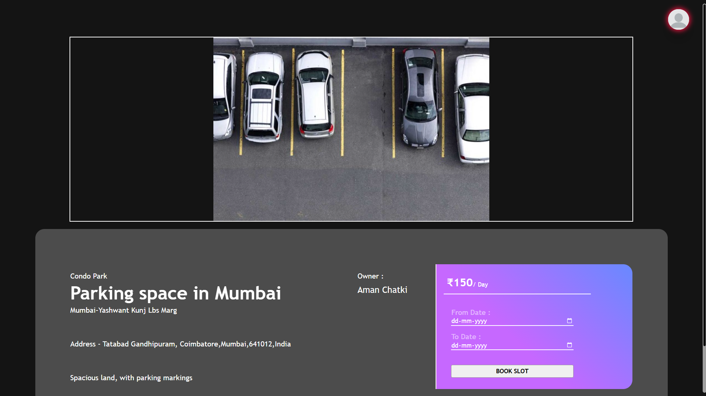
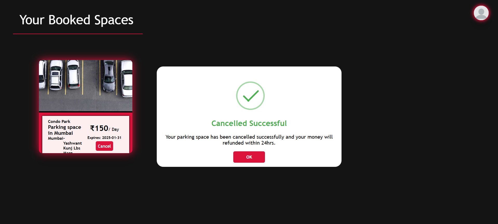
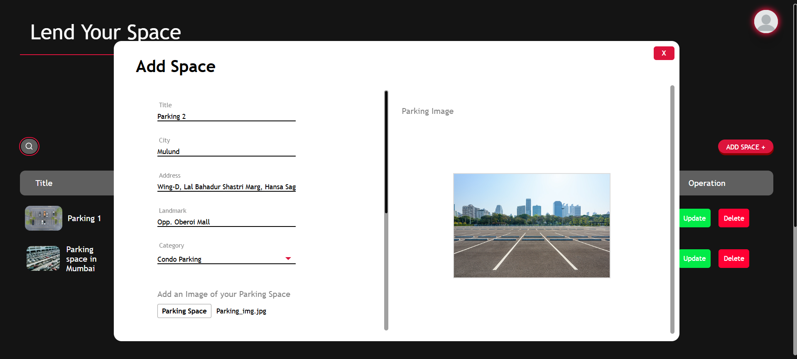
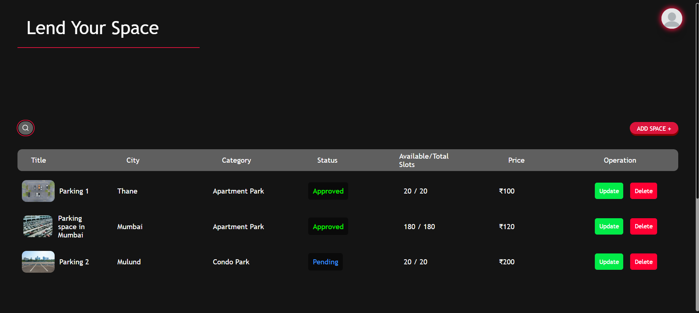
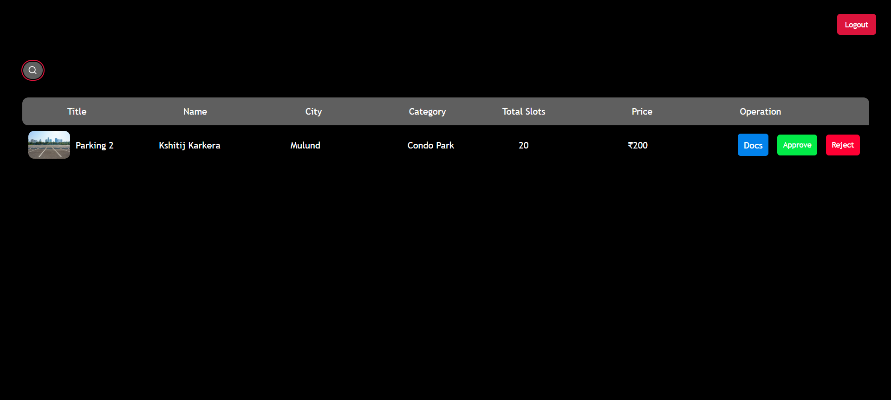
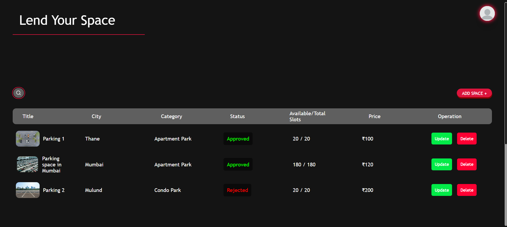

# Park It Down
Park It Down is a Django-based parking management app. Built with Python, JavaScript, jQuery, HTML, and CSS, it uses an XAMPP server for the database. It supports three user roles: Sellers (lend land for parking), Buyers (search parking spots), and Admins (verify and approve seller documents). Simplify parking with Park It Down!

## Features
- **Three User Roles**:
  - **Seller**: List and manage land for parking spaces.
  - **Buyer**: Search and book parking spots conveniently.
  - **Admin**: Verify seller documents and approve/reject parking spaces.

- **Technologies Used**:
  - **Backend**: Django (Python)
  - **Frontend**: HTML, CSS, JavaScript, jQuery
  - **Database**: XAMPP (MySQL)

- **Core Functionalities**:
  - Easy registration and role-based login.
  - Sellers can upload land documents for approval.
  - Buyers can search for available parking spots and make bookings.
  - Admins review seller submissions and manage approvals.

## Run Command

```bash
  cd mysite
```

```bash
  python manage.py runserver
```

## Screenshots
**Home Page**




**Home Page with Parking Spaces**




**Login Page**




**Forgot Password Page**




**Book Slot Page**




**Card Payment Page**


**Payment Successful**


**Your Booked Space Page**


**Cancel Booked Space**




**Add New Space**




**Lend Your Space Page**




**Admin Page**




**Admin's Decision for the Space**


